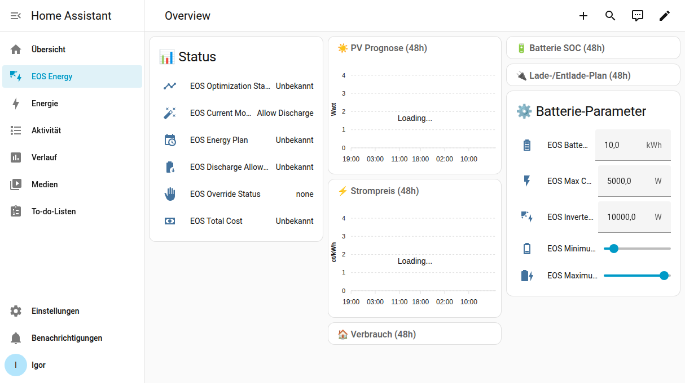

<div align="center">
  

  # EOS-HA

  [](https://github.com/rockinglama/eos-ha/actions/workflows/validate.yml)
  [](https://my.home-assistant.io/redirect/hacs_repository/?owner=rockinglama&repository=eos-ha&category=integration)

  A Home Assistant custom integration for [Akkudoktor EOS](https://github.com/Akkudoktor-EOS/EOS) energy optimization.
  
  German translations included · 4 automation blueprints · Startup in < 1 s
</div>

## What It Does

EOS-HA connects Home Assistant to an [EOS](https://github.com/Akkudoktor-EOS/EOS) server using the **EOS HA Adapter** — a bidirectional data bridge:

1. **EOS reads from HA** — battery SOC, consumption, energy meters, electricity prices, temperature
2. **EOS optimizes automatically** — runs optimization at a configurable interval (default: every hour)
3. **EOS writes results back** — creates `sensor.eos_*` entities with charge plans, forecasts, and schedules
4. **EOS-HA wraps those entities** — adds proper `unique_id`, device grouping, translations, and 48 h forecast attributes

No manual API calls. No polling. EOS handles all forecasts (PV, load, price) natively.

## Requirements

- Home Assistant 2024.1+
- A running [Akkudoktor EOS](https://github.com/Akkudoktor-EOS/EOS) server (addon mode recommended for full adapter support)
- A battery SOC sensor
- A consumption/load sensor
- An electricity price sensor (only if using "External" price source)

## Installation

### HACS (Recommended)

1. Click the badge above, or go to **HACS → Integrations → ⋮ → Custom repositories**
2. Add `https://github.com/rockinglama/eos-ha` as an Integration
3. Search for **EOS HA** and install
4. Restart Home Assistant

### Manual

1. Copy `custom_components/eos_ha/` to your HA `config/custom_components/` directory
2. Restart Home Assistant

## Dashboard



## Configuration

Add the integration via **Settings → Devices & Services → + Add Integration → EOS HA**.

### Config Flow

| Step | What You Configure |
|------|--------------------|
| **1. EOS Server URL** | URL of your EOS server (e.g. `http://192.168.1.94:8503`). Auto-detected when running as addon. |
| **2. Price Source** | Akkudoktor (default), EnergyCharts (bidding zone), or External (any HA sensor) |
| **3. Entities** | Battery SOC, consumption/load, electricity price (if external), temperature (optional) |
| **4. Battery** | Capacity (kWh), max charge power (W), inverter power (W), SOC limits (%), feed-in tariff (Einspeisevergütung) |
| **5. PV Arrays** | One or more solar arrays — azimuth, tilt, peak power, inverter power |
| **6. Energy Meters** _(optional)_ | Load, grid import/export, PV production energy meters for the HA Adapter |
| **7. EV** _(optional)_ | Electric vehicle — capacity, charge power, SOC entity, efficiency |
| **8. Appliances** _(optional)_ | Flexible loads (e.g. Brauchwasserwärmepumpe) with time windows |
| **9. SG-Ready** _(optional)_ | Heat pump relay entities for SG-Ready control |
| **10. Battery Sensors** _(optional)_ | Entities for battery storage price tracking |

### Options Flow

All parameters can be changed via **Settings → Devices & Services → EOS HA → Configure**. Menu sections:

- EOS Server URL
- Entities
- Battery
- PV Arrays
- Price Source
- Energy Meters
- EV
- Appliances
- SG-Ready
- Battery Sensors
- Feed-in Tariff

## EOS HA Adapter

The adapter is the core of v0.6.0. Instead of the integration manually building optimization payloads:

| Direction | What | How |
|-----------|------|-----|
| **HA → EOS** | SOC, consumption, energy meters, prices, temperature | EOS reads HA entity states directly via the adapter |
| **EOS → HA** | Charge plans, forecasts, schedules, SG-Ready recommendations | EOS writes `sensor.eos_*` entities back into HA |

**Energy Meters** (optional but recommended) give EOS access to actual metered data for improved forecasts:

| Meter | Example Entity |
|-------|---------------|
| Load (Hausverbrauch) | `sensor.house_consumption_energy` |
| Grid Import (Netzbezug) | `sensor.grid_import_energy` |
| Grid Export (Einspeisung) | `sensor.grid_export_energy` |
| PV Production | `sensor.pv_production_energy` |

## Price Sources

| Source | Description |
|--------|-------------|
| **Akkudoktor** (default) | Built-in price forecast from EOS |
| **EnergyCharts** | Fetched by EOS from energy-charts.info (configurable bidding zone, default DE-LU) |
| **External** | Any HA sensor (Tibber, ENTSO-E, Awattar, etc.) — pushed to EOS via `ElecPriceImport` provider |

## Entities

All entity IDs are prefixed with `sensor.eos_` (device name "EOS").

### Sensors

| Entity | Description |
|--------|-------------|
| `optimization_status` | `optimized`, `failed`, or `unknown` |
| `ac_charge_power` | Recommended AC charge power (W); 48 h forecast in attributes |
| `dc_charge_power` | Recommended DC charge power (W); 48 h forecast in attributes |
| `current_mode` | `Grid Charge`, `Allow Discharge`, `Avoid Discharge`, or override |
| `pv_forecast` | PV forecast (W); 48 h in attributes |
| `price_forecast` | Price (EUR/Wh); 48 h in attributes, cheapest hours |
| `consumption_forecast` | Consumption forecast (W); 48 h in attributes |
| `battery_soc_forecast` | SOC (%); 48 h in attributes |
| `override_status` | Active override (`charge`, `discharge`, `none`) |
| `total_cost` | Total optimized cost (EUR) |
| `energy_plan` | Current operation mode; full plan in attributes |
| `battery_resource_status` | `available` / `unavailable` |
| `ev_charge_plan` | EV charge plan (`active`/`inactive`); details in attributes |
| `appliance_schedule` | Number of scheduled appliances; details in attributes |
| `battery_storage_price` | Weighted average stored energy cost (EUR/kWh) |
| `sg_ready_mode` | Recommended SG-Ready mode (1–4) |

### Binary Sensors

| Entity | Description |
|--------|-------------|
| `discharge_allowed` | Whether battery discharge is allowed this hour |

### Switches

| Entity | Description |
|--------|-------------|
| `sg_ready_auto_control` | Enable/disable automatic SG-Ready relay switching |

### Number Entities

Adjustable at runtime — changes take effect on the next optimization:

| Entity | Range |
|--------|-------|
| `battery_capacity` | 0.1–100 kWh |
| `max_charge_power` | 100–50 000 W |
| `inverter_power` | 100–50 000 W |
| `minimum_soc` | 0–100 % |
| `maximum_soc` | 0–100 % |

## Services

### `eos_ha.optimize_now`

Trigger an immediate optimization (instead of waiting for the auto-optimization interval).

### `eos_ha.set_override`

| Parameter | Description |
|-----------|-------------|
| `mode` | `charge`, `discharge`, or `auto` (clear) |
| `duration` | Minutes (1–1440, default 60) |

```yaml
service: eos_ha.set_override
data:
  mode: charge
  duration: 120
```

### `eos_ha.set_sg_ready_mode`

Manually set SG-Ready mode for heat pump control.

| Parameter | Description |
|-----------|-------------|
| `mode` | 1 = Lock, 2 = Normal, 3 = Recommend, 4 = Force |
| `duration` | Minutes (0 = until next optimization, default 60) |

```yaml
service: eos_ha.set_sg_ready_mode
data:
  mode: 4
  duration: 30
```

### `eos_ha.update_predictions`

Trigger EOS to recalculate all predictions (PV, prices, load) without a full optimization.

### `eos_ha.reset_battery_price`

Reset the battery storage price tracking to zero.

## SG-Ready Heat Pump

Control your heat pump (Brauchwasserwärmepumpe, Wärmepumpe) via the [SG-Ready](https://www.waermepumpe.de/normen-technik/sg-ready/) standard.

| Mode | Name | Relay 1 | Relay 2 | Meaning |
|------|------|---------|---------|---------|
| 1 | Lock (Sperre) | ON | OFF | Block heat pump (high-price hours) |
| 2 | Normal | OFF | OFF | Standard operation |
| 3 | Recommend (Empfehlung) | OFF | ON | Increased operation recommended (PV surplus / cheap power) |
| 4 | Force (Anlaufbefehl) | ON | ON | Force maximum heating |

**Setup:** Configure two relay switch entities in the SG-Ready config step. The `sg_ready_mode` sensor recommends the optimal mode based on PV surplus, electricity price, and battery SOC.

**Auto mode:** Enable the `sg_ready_auto_control` switch to let the integration automatically set relays based on the recommended mode.

**Manual override:** Use `eos_ha.set_sg_ready_mode` to force a specific mode for a given duration.

## Temperature Entity

Optionally configure a weather entity (`weather.*`) or temperature sensor for temperature forecasts. EOS uses this for load prediction accuracy. Falls back to 15 °C if not configured.

## Flexible Appliances

Add flexible home appliances that the optimizer schedules into the cheapest time slot. Each appliance has:

- **Name** — e.g. "Waschmaschine"
- **Power** — consumption in W
- **Duration** — run time in hours
- **Earliest start** — earliest allowed start hour
- **Latest end** — latest allowed end hour

Results appear in the `appliance_schedule` sensor.

## E-Auto (Electric Vehicle)

| Parameter | Default |
|-----------|---------|
| Capacity | 60 kWh |
| Charge Power | 11 000 W |
| Efficiency | 0.95 |
| SOC Entity | — |

The `ev_charge_plan` sensor shows the recommended charging schedule.

## Feed-in Tariff

Default: **0.082 EUR/kWh** (current German Einspeisevergütung). Change in options under "Feed-in Tariff".

## Battery Storage Price

When battery sensor entities are configured, the integration tracks the **weighted average cost of stored energy** (EUR/kWh):

- Grid-charged energy → valued at current electricity price (adjusted for efficiency)
- PV-charged energy → valued at 0 EUR/kWh
- Persists across restarts (RestoreEntity)

## Automation Blueprints

Four ready-to-use blueprints are included in `blueprints/`:

| Blueprint | Purpose |
|-----------|---------|
| `charge_battery_cheap` | Charge battery during cheapest hours |
| `sg_ready_pv_surplus` | Activate heat pump on PV surplus |
| `notify_cheap_power` | Notify when electricity is cheap |
| `notify_negative_price` | Notify on negative electricity prices |

Import via **Settings → Automations → Blueprints → Import Blueprint** or copy from the `blueprints/` directory.

## 48-Hour Forecasts

All forecast sensors expose a `forecast` attribute with the full 48 h array. Example with [ApexCharts Card](https://github.com/RomRider/apexcharts-card):

```yaml
type: custom:apexcharts-card
series:
  - entity: sensor.eos_pv_forecast
    data_generator: |
      return entity.attributes.forecast.map((val, idx) => {
        const d = new Date();
        d.setMinutes(0, 0, 0);
        d.setHours(d.getHours() + idx);
        return [d.getTime(), val];
      });
```

## Dashboard

A ready-to-use Lovelace dashboard is included at [`dashboards/eos-energy.yaml`](dashboards/eos-energy.yaml).

Cards: Status, PV Prognose, Strompreis, Batterie SOC, Lade-/Entlade-Plan, Verbrauch, Batterie-Parameter.

**Requires:** [apexcharts-card](https://github.com/RomRider/apexcharts-card) via HACS → Frontend.

## Diagnostics

Download via **Settings → Devices & Services → EOS HA → ⋮ → Download Diagnostics**. Sensitive data is automatically redacted.

## Removal

1. **Settings → Devices & Services → EOS HA → ⋮ → Delete**
2. Restart Home Assistant
3. (Optional) Remove `custom_components/eos_ha/` or uninstall via HACS

## License

MIT License — see [LICENSE](LICENSE) for details.
