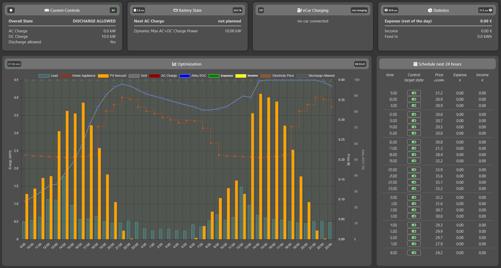

<table style="border:none;">
  <tr>
    <td width="130"></td>
    <td style="vertical-align: middle;"><h1 style="margin:0; padding-left:10px;">EOS Connect</h1></td>
  </tr>
</table>

[](https://my.home-assistant.io/redirect/hacs_repository/?owner=rockinglama&repository=eos-ha&category=integration)

**For full documentation, guides, and configuration details, visit:**
[https://ohAnd.github.io/EOS_connect/](https://ohAnd.github.io/EOS_connect/)

---

## Overview
EOS Connect is an open-source tool for intelligent energy management and optimization. It acts as the orchestration layer between your energy hardware (inverters, batteries, PV forecasts) and external optimization engines. EOS Connect is an integration and control platform—not an optimizer. Optimization calculations are performed by external servers:
- [Akkudoktor EOS](https://github.com/Akkudoktor-EOS/EOS)
- [EVopt](https://github.com/thecem/hassio-evopt)

EOS Connect fetches real-time and forecast data, processes it via your chosen optimizer, and controls devices to optimize your energy usage and costs.

---

## Key Features
- **Automated Energy Optimization:** Uses real-time and forecast data to maximize self-consumption and minimize grid costs.
- **Battery and Inverter Management:** Charge/discharge control, grid/PV modes, dynamic charging curves.
- **Integration with Smart Home Platforms:** Home Assistant (MQTT auto discovery), OpenHAB, EVCC, and MQTT for seamless data exchange and automation.
- **Dynamic Web Dashboard:** Live monitoring, manual control, and visualization of your energy system.
- **Cost Optimization:** Aligns energy usage with dynamic electricity prices (Tibber, smartenergy.at, Stromligning.dk) with hourly or quarterly distribution.
- **Flexible Configuration:** Easy to set up and extend for a wide range of energy systems and user needs.

---


## How It Works
EOS Connect periodically collects:
- Local energy consumption data
- PV solar forecasts for the next 48 hours
- Upcoming energy prices

It sends this data to the optimizer (EOS or EVopt), which returns a prediction and recommended control strategy. EOS Connect then applies these controls to your devices (inverter, battery, EVCC, etc.). All scheduling and timing is managed by EOS Connect.

<div align="center">
  
  <br>
  <sub><i>Figure: EOS Connect process flow</i></sub>
</div>

Supported data sources and integrations:

- **Home Assistant:** MQTT publishing (dashboard, control, auto-discovery) and direct API integration for sensor/entity data collection.
- **OpenHAB:** MQTT publishing (dashboard, control, auto-discovery via MQTT binding) and direct API integration for item data collection.
- **EVCC:** Monitors and controls EV charging modes and states.
- **Inverter Interfaces:** Fronius GEN24 (with automatic firmware detection), legacy fallback, and more or via mqtt contols/ web api controls/ evcc external interver control.


## Quick Start

### Home Assistant Installation (Recommended)
1. **Requirements:**
   - Home Assistant (latest version recommended)
   - EOS or EVopt server (can be installed as part of the setup; see below)

2. **Option A: Install EOS Connect Add-on:**
   - Add the [ohAnd/ha_addons](https://github.com/ohAnd/ha_addons) repository to your Home Assistant add-on store.
   - Install the **EOS Connect** add-on from the store.
  
3. **Option B: Install EOS Connect Add-on:**
   - If you want to use EOS as your optimization backend, add the [Duetting/ha_eos_addon](https://github.com/Duetting/ha_eos_addon) or [thecem/ha_eos_addon](https://github.com/thecem/ha_eos_addon) repository to your Home Assistant add-on store and install the EOS add-on, or ensure your EOS server is running and reachable.
   - If you prefer the lightweight EVopt backend, install [thecem/hassio-evopt](https://github.com/thecem/hassio-evopt) and make sure it is running.

4. **Configure:**
    - Configuration is managed directly via the Home Assistant add-on UI. No manual editing of the config file is required—the add-on processes your settings in the background and applies them to EOS Connect automatically.
    - See the [user-guide/configuration](https://ohAnd.github.io/EOS_connect/user-guide/configuration.html) for full details.

5. **Start & Access:**
    - Start the EOS Connect add-on from the Home Assistant UI.
    - Open `http://homeassistant.local:8081` (or your HA IP) to view the dashboard.

<div align="center">
  
  <br>
  <sub><i>Figure: EOS Connect dashboard</i></sub>
</div>

**Note for Proxmox / VM Users:**
If the add-on crashes with a Segmentation Fault on startup, your VM might be using a generic CPU type.
- Go to your VM Settings > Hardware > Processor.
- Change Type from `kvm64` (default) to `host`.
- Restart the VM.

This allows the add-on to correctly see and use your physical CPU's instructions.

---

**Other Installation Options:**
- Docker, manual, and advanced setups are supported. See the [docs](https://ohAnd.github.io/EOS_connect/user-guide/index.html) for details.

---

## Minimal Configuration Example
```yaml
# Load configuration
load:
  source: default  # Uses a static load profile

# EOS server configuration
eos:
  source: eos_server
  server: 192.168.1.94  # Replace with your EOS/EVopt server IP
  port: 8503
  time_frame: 3600 # EOS server supports 3600 only (hourly); EVopt supports 3600 or 900 (15-minute)

# Electricity price configuration
price:
  source: default  # Uses Akkudoktor price API

# Battery configuration
battery:
  source: default
  capacity_wh: 10000
  max_charge_power_w: 5000
  charge_efficiency: 0.9
  discharge_efficiency: 0.9

# PV forecast configuration
pv_forecast_source:
  source: akkudoktor

pv_forecast:
  - name: myPV
    lat: 52.5200
    lon: 13.4050
    azimuth: 180
    tilt: 25

# Note: Temperature forecast (outside temperature) is only retrieved and sent to the optimizer when `eos.source: eos_server` is set. For `evopt`, temperature is not required and not used in optimization.

# Inverter configuration
inverter:
  type: default  # Options: fronius_gen24, fronius_gen24_legacy, evcc, default

# EVCC configuration (optional)
evcc:
  url: ""  # Set to your EVCC URL if used, e.g., http://evcc:7070

# MQTT configuration (optional)
mqtt:
  enabled: false
  broker: localhost # URL for MQTT server - default: mqtt://yourMQTTserver
  port: 1883 # Port for MQTT server - default: 1883
  user: mqtt_user # Username for MQTT server - default: mqtt
  password: mqtt_password # Password for MQTT server - default: mqtt

# General settings
refresh_time: 3  # Optimization refresh interval in minutes
time_zone: Europe/Berlin
eos_connect_web_port: 8081
log_level: info
request_timeout: 10
```

<div style="margin-top: 1em; padding: 0.8em; background: #222; border-radius: 10px; color: #eee;">
<i class="fas fa-info-circle" style="color: #4a9eff;"></i>
 <strong>Note:</strong> This minimal configuration is sufficient for basic operation with static profiles and default APIs.<br>
For advanced integrations (Home Assistant, OpenHAB, Solcast, Fronius, Tibber, etc.), <strong>additional fields are required</strong> (e.g., <code>url</code>, <code>access_token</code>, <code>soc_sensor</code>, <code>api_key</code>, <code>resource_id</code>, etc.).<br>
See the <a href="https://ohAnd.github.io/EOS_connect/user-guide/configuration.html" style="color: #4a9eff;">full configuration documentation</a> for details on all options and required fields for your setup.
</div>
```
---

## Troubleshooting & Advanced Configuration
For troubleshooting and advanced configuration, see the [docs](https://ohAnd.github.io/EOS_connect/).

---

## Support & Sponsoring
If you find this project useful and would like to support its development, please consider sponsoring:
[https://github.com/sponsors/ohAnd](https://github.com/sponsors/ohAnd)

## Contributing
Contributions are welcome! See [CONTRIBUTING.md](CONTRIBUTING.md) for guidelines.

## License
MIT License - see [LICENSE](LICENSE) for details.
